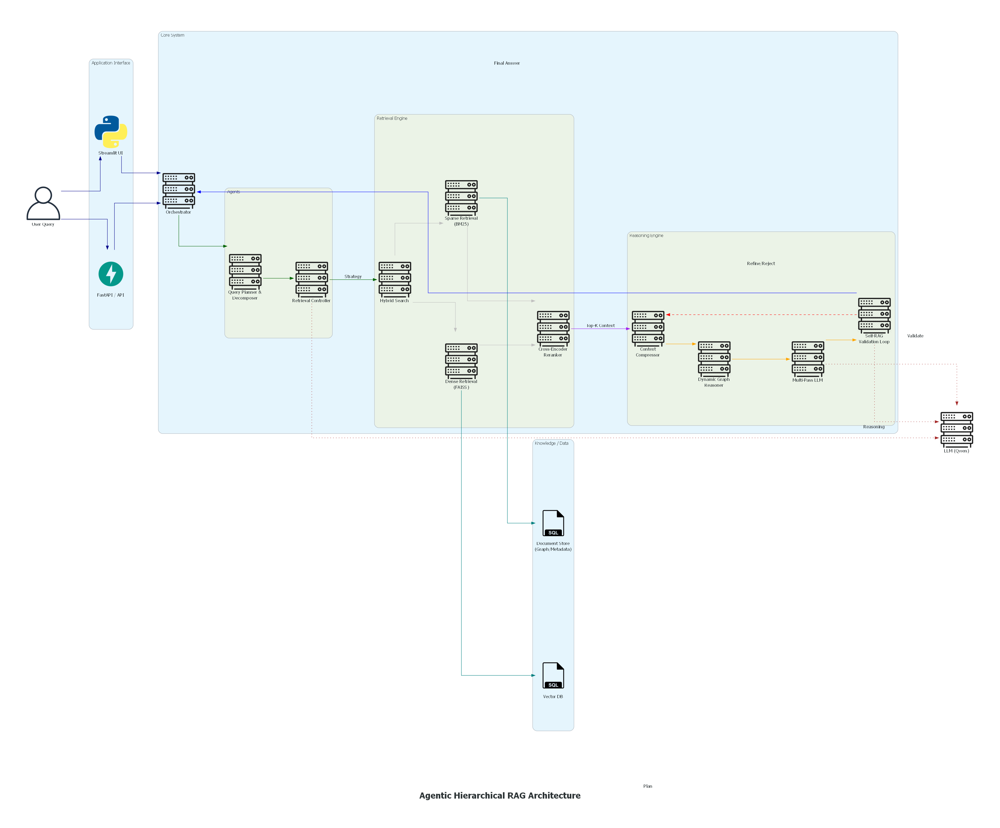

# CogInfera

     <br>
Agentic + Hierarchical + Graph-Augmented + Self-Reflective Reasoning Engine



## Overview

**CogInfera** is an advanced Retrieval-Augmented Generation (RAG) system designed to process complex documents, formulate query plans, and perform multi-hop reasoning. Built with modularity and extensibility in mind, it provides an end-to-end pipeline from document ingestion to intelligent answering, accessible via both a RESTful API and an interactive UI.

## Key Features

- **Intelligent Ingestion**: Parse PDF documents, chunk texts hierarchically, and generate embeddings for semantic search.
- **Advanced Retrieval**: Employs a hybrid retrieval strategy combining dense vector search (FAISS) and sparse search (BM25), finalized by a state-of-the-art reranker.
- **Cognitive Agents**: Features a Query Planner and Retrieval Controller to intelligently augment and orchestrate search strategies.
- **Deep Reasoning**: Utilizes multi-pass reasoning, context compression, graph-based reasoning, and Self-RAG to ensure accurate and hallucination-free outputs.
- **Flexible Interfaces**: Launch the system using a Streamlit/Gradio UI (`ui/app.py`) or integrate it into other services using the built-in API (`api/main.py`).

## Project Structure

```text
CogInfera/
├── agents/            # Query planning & retrieval orchestration
├── api/               # REST API server and adapters
├── data/              # Storage for FAISS index and chunk metadata
├── ingestion/         # PDF parsing, hierarchical chunking & embedding
├── reasoning/         # Multi-pass reasoning, graph logic, and Self-RAG
├── retrieval/         # Dense, sparse, & hybrid search implementations + reranking
├── ui/                # Frontend application (e.g., Streamlit)
├── config.py          # Centralized configuration
├── main.py            # Main entry point for CLI runs
├── orchestrator.py    # Core system coordinator
└── llm_client.py      # Interfaces with LLMs (e.g., via OpenRouter)
```

## Installation

1. **Clone the repository and navigate to the directory:**
   ```bash
   git clone <your-repo-url>
   cd CogInfera
   ```

2. **Create and activate a virtual environment:**
   ```bash
   python -m venv venv
   # On Windows:
   venv\Scripts\activate
   # On macOS/Linux:
   source venv/bin/activate
   ```

3. **Install the dependencies:**
   ```bash
   pip install -r requirements.txt
   ```

4. **Configuration:**
   Update `config.py` or `.env` with your API keys (e.g., OpenRouter API key) and desired model paths.

## Usage

### Running the API
Start the backend API server to expose inference and retrieval endpoints:
```bash
python api/main.py
```

### Running the UI
Launch the graphical user interface for interactive queries:
```bash
python ui/app.py
```

### Command Line Execution
Run the orchestrator or individual scripts directly:
```bash
python main.py
```

## License

MIT License. See `LICENSE` for more information.
